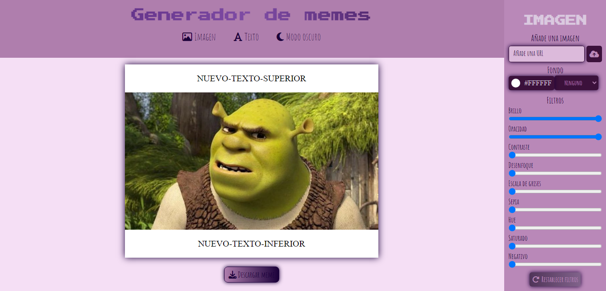
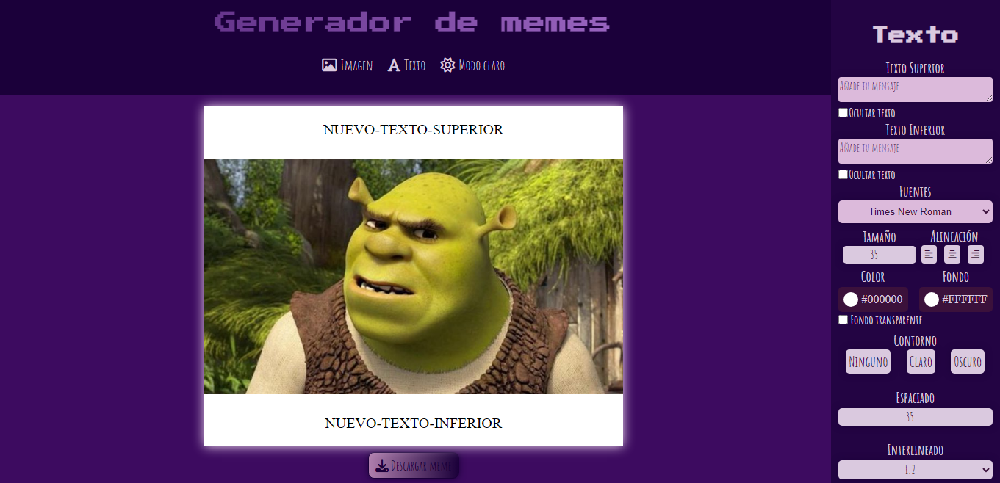
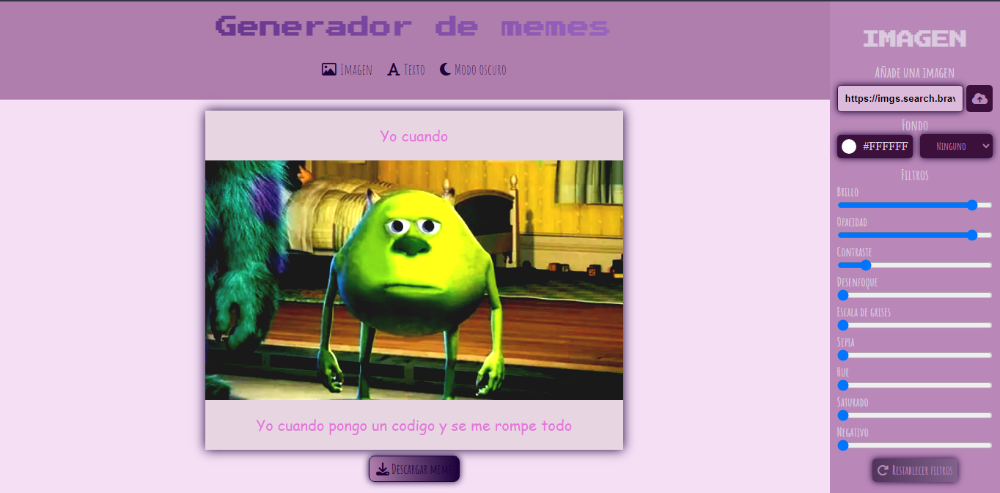
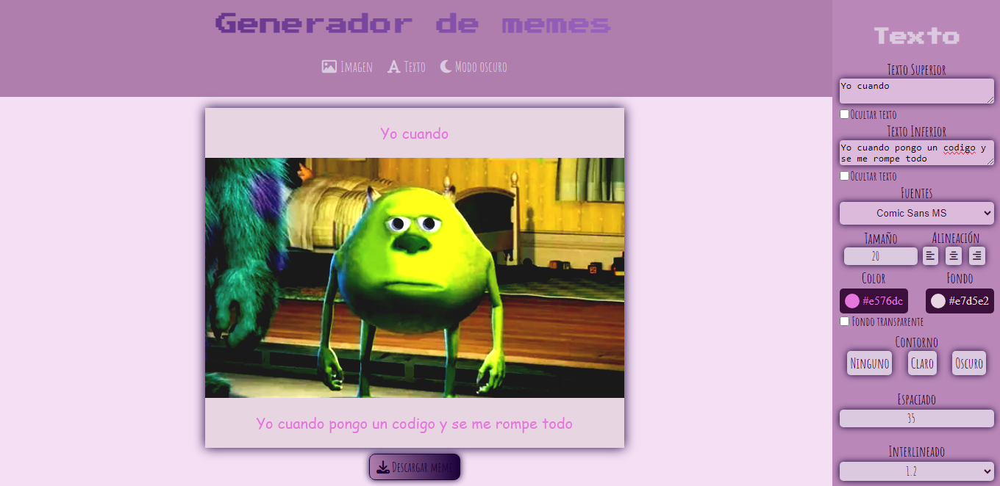

# ✨Generador de MEMES✨

¡Bienvenidos al Generador de MEMES! Les presento este nuevo proyecto desarrollado con HTML, CSS y JavaScript, ofreciendo una plataforma divertida para la creación personalizada de memes.😎

## Desafío con JavaScript

El uso de JavaScript fue un desafío gigante. A pesar de la complejidad😵, encontré formas de manejarla y hacer que la experiencia sea interactiva y divertida.😄

## Les Presento mi GENERADOR DE MEMES

En esta imagen, podemos ver la apariencia inicial de la página, en modo claro. El panel de imágenes nos permite agregar imágenes al meme, cambiar el color de fondo y aplicar filtros.

En el modo oscuro, presento el panel de texto, donde se puede agregar texto superior e inferior al meme. Incluyen opciones para cambiar la fuente, agregar color, color de fondo, contorno e incluso establecer el fondo como transparente.

## Ejemplo con imagen desde URL

Podemos ver que con solo una URL se agrega una imagen al meme. Y podemos apreciar la aplicacion de filtros.😊

Acá vemos como añadimos el texto al meme. Jugamos con la fuente, color, fondo, contorno, espaciado e interlineado.😋

# En conclusión

Este proyecto no solo representa líneas de código, sino la dedicación y emoción por seguir aprendiendo y aplicarlo en cada proyecto. En fin, ¡juguemos y divirtámonos creando memes!🥰
¡Gracias por ver!🤍
